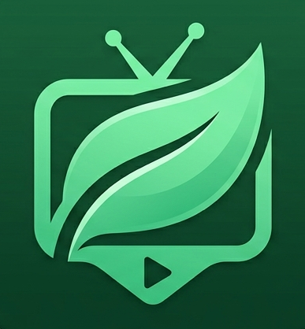

<div align="center">
  
  <h1>🍃 Leaf-TV</h1>
  <p><strong>A lightweight, premium web-based IPTV & Live Streaming interface.</strong></p>

  <p>
    <a href="https://vitejs.dev/"></a>
    <a href="https://developer.mozilla.org/en-US/docs/Web/JavaScript"></a>
    <a href="https://developer.mozilla.org/en-US/docs/Web/CSS"></a>
    <a href="https://vercel.com/"></a>
    <a href="./LICENSE"></a>
  </p>
</div>

<br />

> **Leaf-TV** is a modern, vanilla JavaScript web application designed to parse M3U playlists and stream live HLS / MPEG-TS feeds natively in the browser. Wrapped in a stunning "Liquid Glass" user interface, it combines desktop-level playback control with high-performance Web APIs—demonstrating that you don't need heavy UI frameworks to deliver a premium cinematic experience.

## Why Leaf-TV?

**Leaf-TV** was built as an experiment in how far modern browser APIs can be pushed without relying on heavywieght frontend frameworks. The goal was to deliver a native desktop-style IPTV experience using only **Vanilla JavaScript**, modern **CSS**, and carefully optimized loading strategies.

---

## ✨ Features at a Glance

### 🎨 Liquid Glass UI & Ambient Animations
- **Glassmorphism Design:** Beautiful, translucent sidebar panels with real-time CSS backdrop filtering and a dark gradient overlay.
- **Ambient Particle System:** A lightweight, pure-CSS falling leaf animation running continuously in the background (z-index isolated for zero layout thrashing).
- **Adaptive 16:9 Cinematic Letterboxing:** The video player automatically scales and centers dynamically while preserving a transparent 16:9 cinematic aspect ratio, allowing the ambient background to bleed through seamlessly.

### ⚡ Dual-Engine Playback System
Under the hood, Leaf-TV dynamically routes streams based on network protocols to ensure maximum compatibility and reliability:
- **`hls.js` Engine:** Powers `.m3u8` streams with advanced ABR (Adaptive Bitrate) heuristics, multi-audio track selection, and granular quality control.
- **`mpegts.js` Engine:** Powers raw `.ts` streams, utilizing Media Source Extensions (MSE) to decode live feeds without requiring a heavy transcoding backend.
- **Native Safari Support:** Automatically falls back to native HTML5 HLS decoding on iOS and macOS devices for maximum battery efficiency.

### 📊 Real-Time Telemetry & Settings
- **Playback Inspector:** A live HUD overlay detailing active video resolution, frame rate, exact video/audio codecs, audio sample rates, and live download speeds.
- **Dynamic Track Selection:** Seamlessly switch between embedded audio languages (e.g., English, Spanish) and video resolutions without interrupting playback.

### 🏆 Live Sports Ticker
Currently configured to display FIFA World Cup 2026 fixtures and live scores.
An integrated glass ticker strip situated above the video player that polls real-time World Cup data via the ESPN sports API:
- **Live Match Tracking:** Pulsing red indicator with elapsed game time and live scorelines.
- **Upcoming Countdowns:** Real-time countdown clocks ticking down to the exact second of kickoff, localized dynamically to Bangladesh Standard Time (BST).

### 🔋 "Eco Mode" (Low Performance Toggle)
Built for mobile users and low-end hardware. A single toggle strips out all CSS `backdrop-filter` calculations and halts the DOM particle engine, saving significant GPU cycles and battery life while retaining core functionality.

---

## ⌨️ Keyboard Shortcuts

Leaf-TV acts like a native desktop application. Master the interface without taking your hands off the keyboard:

| Key | Action |
| :--- | :--- |
| <kbd>Space</kbd> | **Play / Pause** toggle. |
| <kbd>Arrow Left</kbd> | **Rewind** exactly 5 seconds. |
| <kbd>Arrow Right</kbd> | **Fast Forward** exactly 5 seconds. |
| <kbd>Arrow Up</kbd> | **Channel Surf Up**: Instantly loads the previous channel in the list. |
| <kbd>Arrow Down</kbd> | **Channel Surf Down**: Instantly loads the next channel in the list. |
| <kbd>F</kbd> or <kbd>Enter</kbd> | **Fullscreen** toggle for the cinematic experience. |

---

## 🏗 Architecture & Tech Stack

This project deliberately avoids React, Vue, or Angular to maintain an intentionally small initial bundle size. 

- **Bundler:** Vite
- **Core Languages:** Vanilla ES6+ JavaScript, HTML5, CSS3
- **Video Decoding:** [Hls.js](https://github.com/video-dev/hls.js/), [Mpegts.js](https://github.com/xqq/mpegts.js)
- **Data Fetching:** Native `fetch()` API
- **State Management:** LocalStorage API (persists theme, eco-mode, volume, and last-used track preferences).

### 🚀 Zero-Blocking Lazy Load
**Leaf-TV** is **designed to achieve sub-second First Contentful Paint on modern hardware and networks.** The core UI skeleton, clock, ticker logic, and CSS are rendered synchronously. The heavyweight video player libraries are **dynamically imported** (`await import()`) in the background only *after* the DOM is visible and interactive.

## 📈 Performance

- ⚡ Initial JavaScript bundle: ~6.7 kB (gzipped)
- 🎨 CSS: ~3.4 kB
- 🚀 First Contentful Paint: ~0.5 s (desktop, Lighthouse)
- 📦 Video playback engines are loaded on demand via dynamic imports

---

## 🛠 Installation & Local Development

Want to run Leaf-TV locally or modify the stream manifest?

1. **Clone the repository:**
   ```bash
   git clone https://github.com/hasan-psl/Leaf-TV.git
   cd Leaf-TV
   ```

2. **Install dependencies:**
   ```bash
   npm install
   ```

3. **Start the local Vite Dev Server:**
   ```bash
   npm run dev
   ```
   *The server usually runs on `http://localhost:5173`. Any changes to JS or CSS will Hot Module Replace (HMR) instantly.*

4. **Modify the Playlist:**
   Place your custom `.m3u` or `.m3u8` playlist in the `/resources/stream/` directory and map it in the `AppConfig` module.

---

## ☁️ Vercel Deployment

Leaf-TV is heavily optimized for zero-configuration Edge deployment on Vercel.

- **Routing:** A `vercel.json` file is included in the root directory to handle standard SPA routing (redirecting all paths to `index.html`).
- **Caching:** Aggressive HTTP `Cache-Control` headers are configured for all compiled `/assets/` ensuring return visitors experience zero-latency loads.

**To Deploy:**
1. Fork or push this repository to your GitHub account.
2. Log into [Vercel](https://vercel.com/) and click **Add New Project**.
3. Import your `Leaf-TV` repository.
4. Leave the default settings (Vite framework preset will auto-detect).
5. Click **Deploy**.

---

## 🤝 Contributing

Contributions, issues, and feature requests are welcome! 
Feel free to check [issues page](https://github.com/hasan-psl/Leaf-TV/issues).

---

<div align="center">
  <p>Made with ❤️ by <a href="https://github.com/hasan-psl">Hasan Imroz</a></p>
</div>
